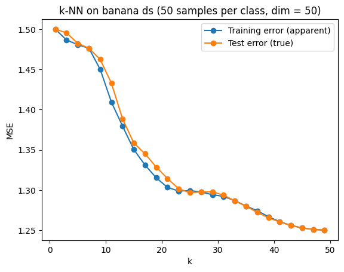
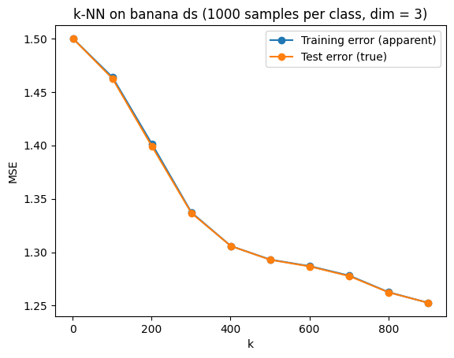
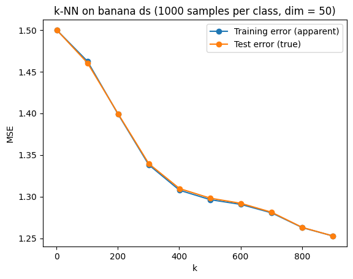

# CS4220 Machine Learning 1 Lab Exercises

### *Delft University of Technology 23/24*

## 1. Basics of Machine Learning

- **Parametric classifiers** assume a finite set of parameters that capture everything there is to know about the data i.e. $P(x | y)$ is approximated by $P(x | \theta)$
    - Classifiers using parametric density estimations + Bayes: `QDA, LDA, NMC`
    -  Quadratic Classifier `QDA` has a quadratic decision boundary, due to limited data. 
        - In the limit, the solutions by `LDA` and `QDA` will coincide
        - With very large regularization ($\lambda \rightarrow \inf$) and equal class priors: `QDA` becomes `LDA`
- **Non-parametric classifiers** assume an infinite set of possible (hyper)parameters that are to be tuned using K-cross validation e.g.
    - Classifiers using non-parametric density estimations + Bayes: `Parzen`, `k-NN`
    - Hyperparameters (such as $h$ in Parzen estimator) should be tuned on test sets independent from training data
        - Optimal value can be found by plotting values (x-axis) against the log-likelihood (y-axis) using elbow method

- **Optimal decision boundary** (where posteriors $P(y1|x) = P(y2|x)$) corresponds to **Bayes error** (i.e. minimal error)

- `Parzen`, `k-NN` and `NMC` are sensitive to **scaling** of features (if you have more than 1 feature), because these methods do not estimate covariance matrices

- How to find out if a feature is conditionally independent of another feature: you have to check for all possible combinations of $X1$ and $X2$ if it holds that:
$P(X1, X2) = P(X1)P(X2)$
That is not easy, because you have to check that for all possible combinations $(X1, X2)$!

- Inverse of $\sum$ (for centered data: $X^TX$) may not exist if:
    - Not sufficient data ($|S_T| <= dimensionality$) i.e. variance of features is 0
        - Use regularization (i.e. add some $\lambda$ to $\sigma$) / dimensionality reduction! 
    - When $|S_T| = dimensionality$, $\sum$ is singular
    - X is not full column rank (features not linearly independent)

 When you have many features, beware of curse of dimensionality! 

 Avoid density estimation (particularly in high dimensional feature space)!  From `k-NN` we saw this is not needed.

Alternatives:
- Have function `f` that describes decision boundary + optimize free parameters of `f` directly
- No Bayes, no density estimates!

### Goal: try to use all information, without overfitting.
- Reduce features
- Simplify models
- Careful optimization

### How does training size / feature dimensionality influence optimal `h` for Parzen?

Generally, increasing training set size leads to a smaller optimal width parameter `h`.
This is not very clear from the plots below, but we can see the (asymptoptic) LL gets much higher (i.e. lower error)!

    
    

It becomes clear that increasing the no. of features leads to a higher optimal `h`:

    
    

Differently from the 2D case however, increasing training set size when we have 30 features does not seem to lead to a higher asymptotic LL... We do see a much higher LL on the train set - and overall a large disprepancy between train and test LL (overfitting).
This is because the classifier becomes very complex.

### How does training size / feature dimensionality influence optimal `k` for K-NN?

Generally, increasing training set size leads to higher optimal `k`. Intuition: more points to consider.

By adding more features, the distances between objects starts to grow, but the
difference between the closest and furthest point starts to get smaller. 
So if you now want to do a K-NN classifier, you typically need a smaller `k`. 
(this is not clear from the experiment results below though)

    
    

    
    

## 2. Linear Regression & Linear Classifiers

> Classification: discrete labels

> Regression: continuous output values

- Differently from labelled datasets (often numeric labels $y$) in supervised classification tasks, **regression datasets** contain continuous inputs $x$ (uniformly distributed e.g.) with a corresponding $y$ depdendent on $x$ ($y = x^2 + \epsilon$ where $\epsilon$ can be some Gaussian noise e.g.)
- We can fit linear functions under the **squared loss** using $w = (X^TX)^-1 * X^T * Y$
    - Note that this metric is *absolute*! So it will be biased towards points with distances larger in absolute magnitude.
    - Typically we have an intercept as well giving $w^T = [w_0, w_1]$ which can be plugged into $f(x) = w_1 * x + w_0$ 
    - Note we need to add a bias term to X

- If data is non-linear, we can apply **feature transformations** (maps data to higher dimension by extending inputs to make them multivariate) to allow for separability
    - e.g. when we apply a 3rd order polynomial: a point $(x_1, y_1)$ may become $((x_1, x_1^2, x_1^3), y_1)$
    - NOTE: applying a linear classifier on transformed data essentially means applying a *non-linear* classifier to the original data!

### Ordinary Least Squares

Goal: minimize squared residuals $\sum_{i=1}^{N}{(y_i - x_i^Tw)}^2$ giving $\hat{w}_{OLS} = (X^TX)^-1X^TY$

- Has similarities with Normal error model
- Statistical validation methods: Tukey-Anscombe Plot, Normal (Q-Q) Plot

| Pros | Cons |
| -------- | -------- |
| Simple, efficient | Assumes linear relationship |
| Best unbiased method | $(X^TX)^-1$ non-existent if features co-linear |
| Suitable for confidence intervals and hypothesis testing | Sensitive to outliers |
| | "Bestness" is under homoscedasticity assumption | 

Below two probabilistic methods (typically Gaussian curve fitting assumed):

### Maximum Likelihood

Goal: maximize likelihood of data $P(y | x, \theta)$

- Probabilistic
- Assumes Gaussian $P(y|x)$ ~ $N(y_i | w^Tx_i, \sigma^2)$
- Point estimate $w_{ML} = w_{OLS}$ but they are different!

<!-- | Pros | Cons |
| -------- | -------- |
| | |
| | |
| | | -->

### Maximum a Posteriori (MAP)

Goal: maximize posterior (objective) $P(\theta | x, y) = P(y | \theta, x) * P(\theta)$ by incorporating prior knowledge on weights for which we assume Gaussian model - combined with actual data (MLE). Gives $\hat{w_{MAP}} = (X^TX + \frac{\sigma^2}{\sigma_\theta^2}I)^{-1}X^TY$

- Probabilistic 
- Bayesian + Gaussian assumption: $\hat{w_{MAP}} = max_w (N(y_i | w^Tx_i, \sigma^2) \cdot N(w | 0, \sigma_\theta^2))$

| Pros | Cons |
| -------- | -------- |
| Can act like regularization | Slightly increases bias (but outweighted by decrease in variance) |
|  | Imposes cost on model params |
| | |

- **Polynomial Regression** fits a polynomial of some *maximal* degree to the data in a least squares sense
    - *Note: even though this results in a non-linear function in x, the regression function is linear in the unknown parameters w estimated from the data.*
    - If there are 4 data points, one needs at least a third-order polynomial to fit these (whether there is a bias term does not matter)
    - Note that linear regressors (`linearr`) do not take into cross-terms, leading to high error rates when trained on (non-linear data) that contain multiplications of $x_i$ terms: e.g. data modelled as $y = sin(x1)sin(x2)$
- **Decision boundary** of **linear classifier** is found at $f(x) = y = 0$
    - $y = ax + b$ with intercept $b = -w_0 / w_2$ and slope $a = -(w_0/w_2)/(w_0/w_1)$

## 3. Losses, Regularization, Evaluation

- Regularization aims to stabilize objective functions to prevent overfitting - possibly caused by curse of dimensionality or lack of data (multicollinearity)
    - **Ridge regularization (L2)** keeps weights small
    - **Lasso regularization (L1)** introduces sparsity and can get rid of redundant features
    - Whereas $w_i$ entries can become 0 for large $\lambda$ (i.e. small $\tau$) in L1 regularization, this is impossible for L2
- The optimal regularization parameter $\lambda$ can be found using **cross-validation** (hyperparameter tuning)
    - **K-fold Cross Validation**: N chunks used for training independent classifiers (take avg of $N$ error estimates), 1 chunk used for evaluating (compared against *true error* on full training set)
    - **Leave-one-out-Procedure**: Single test object

- *Variabililty in error* is larger for small training sets...
    - The more complex the model, the more training samples needed! 
    - *Large, independent test sets* yield an unbiased and small variance error estimate (but worse classifier due to less data used for training..)
    - *Small, independent test sets* yield an unbiased and large variance error estimate

### What is the effect of `K` on bias and variance in error estimates?

In the experiment below, we show error rates and variance in error estimates for various values for `K` (no. of chunks in K-fold cross validation).

- Overall, having a larger dataset (to be split into N chunks for training + separate test set) leads to *lower error rates*: both bias and variance are lower since there are less fluctuations.

- As K increases, *error rates go down* since we average over more classifiers. Later this decrease steeps though. 
    - For the same reason, the error estimates will also be *less biased*.

- What happens to *variance in error estimates* as K becomes larger? There are actually two competing forces:
    - By increasing `k` you get smaller testing folds, therefore poorer error estimates (i.e. larger variance)
    - But you also have more of these chunks, so you also average over more values (i.e. smaller variance)
    
    Which of the two forces is winning is not always clear.
   

    
    

- **Learning curves** show classification errors against the training set size
    - The discrepancy between *true error* and *apparent error* is **overfitting**
- **Feature curves** show how the classification error varies with varying numbers of feature dimensionality
    - **Curse of dimensionality** = error goes up after a certain dimensionality threshold 

## 4a. Probabilistic Models 

- **Maximum Likelihood** finds the parameters $w$ that maximize $P(x, y | w)$, i.e. probability of observed data
- **Maximum A Posteriori** finds $w$ that maximize $P(w | x, y) = P(x, y | w) * P(w)$, i.e. it assumes some prior knowledge about the weights in $P(w)$ - e.g. uniform in $[a,b]$ or Gaussian distribution $N(w | \mu, \sigma^2)$
    - Prior increases bias, but reduces variance
    - The *Haldane prior* is an improper prior that does not satisfy all properties of a pdf
        - Leads to uniform posterior $P(w | x, y)$, so no unique MAP solution
    - $w_{MAP}$ may coincide with the solutions for Ridge (R2) and Lasso (L1) regularization, depending on assumptions made on the prior
- **Predictive Distribution** is based on MAP but rather than a point estimate, it models a *distribution* that is updated using observed data

- **Bayesian Inference**: treat parameters of model $P(\theta | D)$ as RVs and update their distributions when observing data.
- **Bayesian networks** allow us to reason about dependencies between random variables and thus construct $P$ from simpler components 
    - Given $N$ RVs, there are $N!$ possible decompositions
    - Even if not all assumptions are valid, model complexity is still lowered due to fewer parameters to estimate 

## 4b. Clustering

- Clustering aims to find patterns in unstructured data
- **Agglomerative Hierarchical Clustering**
    - Input: dataset `X`, distance matrix `D` and linkage type (single, average complete)
    - Output: dendogram
    - Algorithm stops when there is 1 cluster left, after which we cut the dendogram to obtain the desired no. of clusters (long vertical bars imply large distances)
    - *Single linkage is sensitive to outliers!*

- **Cluster validation** is used for assessing clusterings and no. of clusters
    - **Fusion level maps** plot the linkage distances (y-axis) against the number of clusters (x-axis)
        - Heuristic: cut the dendogram at largest jump
    - **Davies-Bouldin Index (DBI)** is a cluster score that incorporates both **within-** and **between scatters**
        - Heuristic: pick the no. of clusters that minimizes the DBI (minimum in plot)

### Partitional Techniques

#### K-means

- Not deterministic: Many random initializations of clusters have to be tried, particularly for highly dimensional data, to avoid getting stuck in local minima
- Tries to minimize trace of within-scatter for every cluster: $Tr\{S_w\} = \frac{1}{n} \sum_j{S_j}$
    - Within-scatter of one cluster: $S_j = \sum_{i = 1}^{n_j}{|x_i - \mu_j|^2} \leftrightarrow $ sum of diagonal entries in $\Sigma_j$
    - Total within scatter: $S_w = \sum_{i=1}^m \frac{n_i}{n} \Sigma_i$
    - Between scatter: $S_B = \sum_{i=1 00}^{m} \frac{n_i}{n}(\mu_i - m)(\mu_i - m)^T$
- When $k \rightarrow n$: $Tr\{S_j\} = 0$
- When $k \rightarrow 1$: $Tr\{S_j\} = var(X)$

| Pros | Cons |
| -------- | -------- |
| Simple, fast     |  Assumes spherical/convex clusters  | 
| |  Sensitive to initialization  | 
| |  Susceptible to scaling of features  | 
|  | Can get stuck in local minima (*start from many random initializations*) |
| | Clusters can lose all samples (*remove cluster or split largest into 2*) | 

#### Mixture of Gaussians (soft / probabilistic)

- Not deterministic: EM is repeated with different initializations to find $\theta$ with highest likelihood

- When diagonal entries of $\sum$ (i.e. $\sigma$) become VERY small, we essentially have K-means!

-  We assume K separate distributions, one for each cluster
- The  **EM-algorithm** is used to approximate model parameters
    - E-step: Update membership $P(C_k|x; \theta)$ based on updated classifier
    - M-step: Improve model by updating maximum likelihood estimates ($L(\theta | x) = \prod^N_{i=1}p(x_i|\theta)$) of parameters based on cluster membership

| Pros | Cons |
| -------- | -------- |
| Can use prior knowledge on cluster distribution |  Assumes a priori known no. of clusters  |
| Gives general framework for any density mixture | Need to define a cluster density (e.g. Gaussian) |
| Allows for overlapping clusters | Guarantees finding of *local* optimum only |
| Accounts for difference in scale through $\sum_j$ | May converge slowly |
| Allows for various cluster shapes |  Is dependent on initialization: random memberships  | 

#### Mean Shift

| Pros | Cons |
| -------- | -------- |
| Does not assume spherical/convex clusters | Computationally expensive |
| Just a single parameter (window size) | Output depends on window size |
| Finds variable no. of modes | Does not scale well with dimension of feature space |
| Robust to outliers | |2+++++++++++++++++++++++++++++++++++++++++++++++++ 
| Finds global optimum | |

### Hierarchical Techniques

- Pick the best linkage type based on shape of data!

| Pros | Cons |
| -------- | -------- |
| Dendogram gives intuitive overview of possible clusters | Single linkage is sensitive to outliers |
| Linkage type allows for clusters of varying shapes (convex and non-convex) | Computationally expensive! $O(n^2)$ in time and space |
| Different dissimilarity measures can be used | Clusterings limited to "hierarchical nestings" |

### Graph Techniques

#### Spectral Clustering

| Pros | Cons |
| -------- | -------- |
| Can operate on arbitrary graphs |  Assumes a priori known no. of clusters   |
| Clusters can have any shape | Requires a K-means clustering anyways |
| All no. of clusters are possible | Computationally relatively expensive ($O(N^3)$ for non-sparse matrices) |

## 5. Complexity

- Complexity = ability to fit to any distribution of data
    - != #features != #params 
    - Choose complexity according to available data (training set size, dim, class overlap, class shape...)!

- The **Support Vector Machine (SVM)** is a linear classifier that aims to minimize the VC-dimension (complexity metric) by constrained optimization
    - $g(x) = w^Tx + w_0 = \sum^{N}_{i=1}{\alpha_iy_ix_i} + w_o$ 
- Its solution $w = \sum^{N}_{i}{a_i}y_ix_i$ is expressed in terms of objects ("constraints"), rather than features
    - We refer to those objects with $a_i > 0$ as support vectors - only these have influence on the classifier
- *Problem 1: data should be linearly separable*
    - Idea: introduce **slack variables** $\varepsilon$ to weaken the constraints of the optimization problem
- *Problem 2: decision boundary should be linear*
    - Idea: use the **kernel trick** to map data to high dimensional feature space - allows for varying complexity 
    - $K(x, y) = \Phi(x)^T\Phi(y)$ 
    - Polynomial kernel: $K(x,y) = (x^Ty + 1)^d$
    - Gaussian / Radial Basis (RDF) kernel: $K(x,y) = e^{-\frac{|||x-y||^2}{\sigma^2}}$
        - Basically a weighted version of Parzen density estimator! However, faster since we only care about the support vectors (not all data points) 

## 6a. Feature Reduction

### Feature Extraction

**Principle Component Analysis** - Unsupervised

- Does not directly reduce dimensions, but projects data to new space i.e. moves x-axis into principle axis of largest variation (`PC 1`) by translation and rotation

- Global and linear: minimizes squared reconstruction error 

-  Not scaling invariant! 
-  Can only be applied to data that is linearly separable  - else use kernel function $\Phi$ 
-  May need considerable amount of data to estimate cov matrix well 
-  Criterion not necessarily related to goal - may discard useful data 

**Linear Discriminant Analysis (Fisher Mapping)** - Supervised

- Similarity with PCA: projects data onto new axes to reduce dimensionality
- Difference: maximizes *separability of classes* rather than *global variance*
- Choose $\alpha$ to maximize Fisher criterion: $J_F(a) = \frac{\alpha^T S_B \alpha}{\alpha^T S_W \alpha} \leftrightarrow \frac{(\mu_1 - \mu_2)^2}{\sigma_1^2 + \sigma_2^2}$ in 1D

### Feature Selection

Exhaustive search gives ${d}\choose{k}$ = $\frac{d!}{k!(d-k)!}$ possible subsets... 

Total combinations for any $k$: $\sum_{i=1}^d$ ${d}\choose{i}$

Greedy approximations: **Simplest Variation**, **Forward Selection**, **Backward Selection**, **Plus-l-take-away-r**

Criteria to use in approximations above:

- **Heuristic Scatter Based** e.g. $J_1 = trace(S_w + S_B) = trace(\sum)$

- **Mahalanobis Distance**: distance measure between point and *distribution* - unlike Euclidean, accounts for variability in features! Assumes Gaussian distributions with equal $\Sigma = C$

$D_M = (\mu_1 - \mu_2)^TC^-1(\mu_1 - \mu_2)$

- **Fisher Criterion**: seeks to minimize within-scatter and maximize between-scatter

$J_F = \frac{(\mu_1 - \mu_2)^2}{\sigma_1^2 + \sigma_2^2}$

## 6b. Combining Classifiers

- Why combining? 
    - Even if one classifier performs better than another, former may still be better in particular part of feature space
    - Stabilizing variable classifiers

- Decision trees: first form of combining classifiers (greedily) by having various thresholds (essentially linear classifier) that together lead to the final predicted class $y_i$    
    - Variance can be reduced by combining and averaging -> **bagging** models this variability by resampling, building new trees and averaging them

### Fixed Combining Rules

<!-- - Special trained rules based on "classifier confidences" -->

Base classifier: $y = S(x | \theta_{base})$

Combining classifier: $z = C(y | \theta_{comb})$

Different combining rules possible: 
- Product, minimum
- Sum (mean), median, majority vote
- Maximum

 Supoptimal: neglect the classification confidence characteristic of the base classifier outputs, as they are treated as general feature values... Larger training sets do not improve this.... 

### Trained Combining Rules

- General trained rules interpreting base-classifier outputs as features

- Output: posterior probability distribution over all $C$ classes, rather than a single class decided by a fixed combining rule.

Special trained combiners:
- DT: Decision Templates ~ Nearest Mean
- BKS: Behavioral Knowledge Space
- DCS: Dynamic Classifier Selection
- ECOC: Error Correcting Output Coding
- NN: Neural Networks

#### Generation of Base Classifiers

Base classifiers are trained on systematically different training sets!

| Pros | Cons |
| -------- | -------- |
| Simple, not overtrained (especially not for trained combiners) |  Weak: should be combined! |
| Many: fast training / execution | Large bias, large variance - soft outputs may be helpful |

- **Random Subspace** ~ different feature samplings
    - Select random $N$ subsets of $k' < k$ features 
    - Train $N$ classifiers and combine

- **Bagging (Bootstrap & Aggregate)** ~ different object samplings 
    - Select random $N$ subsets of $m' < m$ training samples
    - Train 1 classifier (original: decision tree)
    - Combine (original: vote)

**Random forests** combine bagging and random subspace approach.

- **Boosting**
    - Greedily constructs 2-class classifier
    - Sample training set of size $m' < m$ according to a set of object weights (initially equal)
    - Train a weak classifier
    - Increase weights of erroneously classified objects
    - Repeat and combine eventually

 **AdaBoost**: adaptive way of boosting by lowering weights for points for which we obtain good performance already, so we adjust to complex points/feature spaces and update base classifier accordingly
- Assumes decision stump as weak base classifier
- Minimizes exponential error
-  Suffers from overtraining when combining ~ >= 1000 classifiers... - large discrepancy between true error and apparent error (never converge)  

### Neural Networks

- **Perceptron** = 2-class linear disciminant
    - When classes are not linearly separable, indefinite training - weights will blow up! 
    - Use non-linear activation functions!
- **Neural Network** = multi-layered perceptrons with non-linear activation functions (e.g. sigmoidal, step)
    - Incremental update of weights through backpropagation ( = clever gradient descent i.e. updates can be parallellized)
    - X hidden layers
    - Linear output units
    - Low $w \leftrightarrow$ low complexity so by stopping in time we automatically regularize! 
    - #params = $\sum_{l = 1}^{o -1}{(n_l + 1) * n_{l+1}}$ so summing up units per layer
        - e.g. when $p = 10$ (dim), $C = 2$ (binary classification) and we have two $20$-unit hidden layers: $(10 + 1) * 20 + (20 + 1) * 20 + (20 + 1) * 2 = 682$

| Pros | Cons |
| -------- | -------- |
| Complex enough NNs can separate any training set | Can get stuck in local optima |
| More flexible than AdaBoost / decision trees | Choice of network topology |
| | Danger of overtraining! Use small networks / regularize weights. |
| | Not very explainable |

## Overview Classifiers

### Classification - discrete labels

##### Parametric

`Naive Bayes`
- Assigns test object to class with highest posterior:
    - $P(y | x) = \frac{P(x|y)P(y)}{P(x)}$
- Assume independent features, given a class! The `Bayes Classifier` does not make this assumption.
    - Given a dataset, the `Bayes` classifier has the lowest classification error! 
- The classification error found for an infinite training set is for the `Bayes` classifier a non-increasing function of the no. of features

`Discriminant Analysis: QDA, LDA, NMC`
- Model each class as a Gaussian distribution
- Optimization criteria: use (log-)likelihood to tune $\sum$, $\mu$, class priors $P(y)$
- In case of regularization, set free param $\lambda$
- `QDA`
    - Classification of new point $z$: $\hat{y} = sign((z - \mu_B)^T \sum_B (z - \mu_B) - (z - \mu_A)^T \sum_A (z - \mu_A))$
    - Coincides with `LDA` in the limit
    - Equivalent to `Gaussian Naive Bayes` if $\sum$ is diagonal and the input features are conditionally independent in each class 
    - Cost of training: expensive for high-dimensional data, as we need to invert $\sum$...
    - Cost of evaluating new test object: matrix multiplication $\sum * X$ so can be parallelized
- `LDA`
    - Classification of new point $z$: $\hat{y} = sign((\mu_1 - \mu_2)^T \hat{\Sigma^{-1}}x + C) $  
- `NMC`
    - Classification of new point $z$: $\hat{y} = (\hat{\mu_1} - \hat{\mu_2})x + C $ 

##### Non-parametric: $P(x|y) = P(x | \theta)$

`Parzen`
- Fixed cell volumes located on every training point
- Define Kernel - can be any distribution but Parzen uses Gaussian
- Estimate $\hat{P}(z | h) = \frac{1}{N} \sum_{i=1}^{N}{K(||z - x_i||, h)} = \hat{P}(x|y_i) = \frac{1}{n_i} \sum_{j=1}^{n_i}{N(x | x_j^{(i)}, hI)}$

`k-NN`
- Cell volumes can grow
- Count how many objects of each of the classes are member of the $k$ neighbours: $\hat{P}(x|y_i) = \frac{k_i}{n_i * V_k}$
- Class priors estimation: $P(y_i) = \frac{n_i}{n}$

`Support Vector Machine`

- Classification of new point $z$: $\hat{y} = sign(w^T * z + w_0)$ 

- Non-linear SVM using a kernel: $\hat{y} = sign(\sum_{i}{\alpha_i y_i K(z, x_i)})$

- Optimization criteria: maximize margin to tune Lagrange multiplier $\lambda_i$ for each object

- Introduction of slack variables comes with cost $C$ - a free param to set by user

- Cost of training: expensive in no. of training objects, as we need to solve quadratic program...
- Cost of evaluating new test object: inner product is OK, but in case of nonlinear SVC, computation of kernel may become expensive!

`Linear Regression (OLS)`
- Outputs continuous $y$ given some $x$
- Minimizes Least Squares Error: $J(w) = E[|y - w^Tx|^2]$

`Logistic Regression`

Models the log of the ratio of the class probabilities as a linear function:

Maximizes $\sum_{x \in y_1}{log(\frac{1}{1 + e^{-f(x)}})} + \sum_{x \in y_2}{log(\frac{1}{1 + e^{f(x)}})}$

Classification of new point $z$: $\hat{y} = sign(w^T * z + w_0)$

- Optimization criteria: use (log-)likelihood to tune $f(x)$
- In case of regularization, set free param $\lambda$

- Cost of training: gradient ascent is expensive when we have many features!
- Cost of evaluating new test object: inner product is OK

`Fisher (LS regression classifier)`
- Find fit $f(x)$ that minimizes LS error
- Set decision boundary at $f(x) = 0$

`Perceptron`
- Is able to solve the XOR problem
- Optimization criteria: minimize no. of misclassified objects $J(w) = \sum_{misclassified x_i}{-y_iw^Tx_i}$

